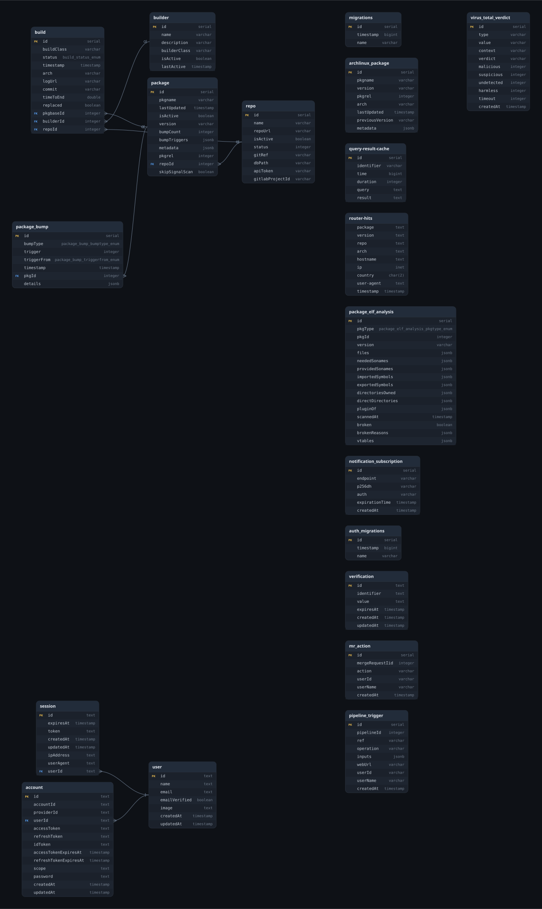

# Chaotic-AUR Next

Monorepo for the TypeScript projects that power [Chaotic-AUR](https://aur.chaotic.cx).
It contains the backend API, the frontend website and a small shared library.

- **backend/** — NestJS (Fastify) API: repository management, package/build data,
  router & download metrics, GitLab integration, authentication
- **frontend/** — Angular (OptimusUI) website
- **shared-lib/** — shared constants and TypeScript types used by both

## Features

- Repository management: watches Arch Linux (core/extra) for updates, computes
  rebuild triggers and bumps dependent Chaotic-AUR packages
- **ELF signal scanner**: scans `.pkg.tar.zst` archives with `bsdtar`, `readelf`
  and `nm` to index sonames, imported/exported symbols and directory ownership.
  This drives dependency detection and catches plugin breaks (e.g. kwin) that a
  plain soname diff would miss.
- Package, router and download-metrics API
- Chaotic-AUR website with charts, build logs, MR overview and mirror map
- GitLab integration for merge request reviews and pipelines

## Tech Stack

- [Nx](https://nx.dev) monorepo management
- [NestJS](https://nestjs.com) on [Fastify](https://fastify.dev)
- [Angular](https://angular.dev) with [OptimusUI](https://github.com/openng/optimus-ui) and TailwindCSS
- [TypeORM](https://typeorm.io) + PostgreSQL
- Redis (Chaotic Manager / Moleculer microservice)
- [Moleculer](https://moleculer.services) for build events
- TypeScript, Vitest

## Prerequisites

- Node.js 26+ and `pnpm` 11+
- A PostgreSQL database
- Redis (optional; only needed for Moleculer build-event handling)

Copy `.env` to your environment and adjust at least `PG_*`, `CAUR_JWT_SECRET`
and `CAUR_USERS`. A local development setup can use a `docker run` Postgres:

```bash
docker run --name chaotic-pg -e POSTGRES_USER=chaotic -e POSTGRES_PASSWORD=chaotic \
  -e POSTGRES_DB=chaotic -p 5432:5432 -d postgres
```

## Development

Install dependencies:

```bash
pnpm install
```

Start the backend and frontend (in two terminals):

```bash
pnpm start:be-nx
pnpm start:home
```

- Backend runs at `http://localhost:3000`, Swagger docs at `http://localhost:3000/api`
- Frontend runs at `http://localhost:4200`

The frontend dev server proxies `/backend` to `localhost:3000`, `/api` and
`/router` to the production endpoints (see `frontend/proxy.conf.json`). To use a
local CORS-enabled API proxy instead, change `CAUR_BACKEND_URL` /
`CAUR_API_URL` in `shared-lib/src/lib/types.ts` and run `pnpm proxy:api` /
`pnpm proxy:be`.

### Build, test, lint

```bash
pnpm build                  # build all projects
pnpm test                   # run all tests
pnpm test:e2e               # run backend tests
pnpm test:coverage:combined # run all tests and generate a combined coverage report
pnpm lint                   # run all linters (eslint)
pnpm format                 # format with prettier
```

You can also target a single project, e.g. `pnpm exec nx test backend`.

## Environment variables (backend)

See `backend/src/config/` for the full list. The most important ones:

| Variable                                  | Default                            | Description                                                |
| ----------------------------------------- | ---------------------------------- | ---------------------------------------------------------- |
| `PG_HOST` / `PG_PORT`                     | `localhost` / `5432`               | PostgreSQL connection                                      |
| `PG_USER` / `PG_PASSWORD` / `PG_DATABASE` | `chaotic`                          | PostgreSQL credentials                                     |
| `NODE_ENV`                                | `development`                      | `production` disables TypeORM schema sync                  |
| `CAUR_PORT`                               | `3000`                             | Backend listen port                                        |
| `CAUR_DB_KEY`                             | —                                  | AES key used to encrypt repo API tokens at rest            |
| `CAUR_JWT_SECRET`                         | —                                  | JWT secret for the backend                                 |
| `REDIS_PASSWORD` / `REDIS_SSH_*`          | —                                  | Redis + SSH tunnel for Moleculer events                    |
| `REPOMANAGER_SCHEDULE`                    | `0 * * * *`                        | Cron schedule for the repo-manager run                     |
| `REPOMANAGER_MIRROR_URL`                  | `https://arch.mirror.constant.com` | Arch mirror used for the `.files` DBs and package archives |
| `REPOMANAGER_MIRROR_POLL`                 | `0 * * * * *`                      | Cron schedule for mirror `lastupdate` polling              |
| `REPOMANAGER_SIGNAL_SCAN_ENABLED`         | `false`                            | Enable the ELF signal scanner                              |
| `REPOMANAGER_ABI_DRY_RUN`                 | `true`                             | Log plugin-ABI bumps instead of rebuilding                 |
| `VIRUSTOTAL_API_KEY`                      | —                                  | Enables VirusTotal checks of MR sources and download URLs  |
| `VIRUSTOTAL_REQUEST_SPACING_MS`           | `15000`                            | Pause between VirusTotal requests (free tier: 4/min)       |
| `VIRUSTOTAL_POLL_INTERVAL_MS`             | `20000`                            | Pause between polls of a running VirusTotal URL analysis   |

## Repo manager and the ELF signal scanner

The repo manager (`backend/src/repo-manager/`) watches the Arch mirror:

1. A cron job pulls the `core`/`extra` `.files` databases on the configured
   `REPOMANAGER_SCHEDULE`.
2. It diffs package versions against the stored `archlinux_package` rows to find
   changed packages, then clones the Chaotic-AUR repos and computes rebuild
   triggers (explicit, global, dependency or plugin-ABI based).
3. When `REPOMANAGER_SIGNAL_SCAN_ENABLED=true`, changed Arch packages are
   downloaded and scanned for ELF signals before triggers are computed.

A second cron job polls the mirror's `lastupdate` file so repo re-syncs are
noticed near-instantly (`REPOMANAGER_MIRROR_POLL`).

### ELF signal scanning

The scanner (`backend/src/repo-manager/signal.ts` + `signal-scan.service.ts`)
downloads a package archive and, per shipped ELF object (shared objects **and**
executables):

- `bsdtar -tf` → file list (used for directory-ownership / plugin detection)
- `bsdtar -tvf` → executable bit per file (to also read `DT_NEEDED` of binaries)
- `readelf -d` → `DT_NEEDED` + `SONAME`
- `nm -D --undefined-only` → imported symbols
- `nm -D --defined-only` → exported symbols (shared objects only)

Results are stored in `package_elf_analysis` (keyed by `pkgType`, `pkgId`,
`version`); the directory-ownership index used for plugin detection is derived
from it in memory on demand.

### Broken-dependency detection

Each analysis also carries a `broken` flag + `brokenReasons`. A package is
flagged broken (the static equivalent of checkrebuild's `ldd "not found"` scan)
when it:

- links a soname (`DT_NEEDED`) that neither the global provided-soname index nor
  the base system provides — a dependency was dropped or its soname renamed, or
- ships files under a **stale versioned runtime directory** — e.g. files in
  `usr/lib/python3.12/...` after the repo's `python` moved to 3.13 (same for
  perl/ruby/ghc).

The provided-soname index is built from all stored analyses, so a full mirror
index must be seeded first for accurate results. Missing-soname detection is
skipped until the index is populated to avoid false positives on a fresh DB.

When `REPOMANAGER_SIGNAL_SCAN_ENABLED=true`, a package that _newly_ becomes
broken after an Arch update is rebuilt automatically (a `BROKEN_DEPS` bump).
Only breaks introduced by the current run count, so long-standing issues don't
cause rebuild loops. Like the plugin-ABI channel, this respects
`REPOMANAGER_ABI_DRY_RUN` (log-only unless set to `false`).

## Database migrations

The schema is managed with TypeORM migrations. They run **automatically at
startup** (`migrationsRun: true` in `backend/src/data/data.source.ts`), so a fresh
database is created on the first boot without manual steps.

## Database structure (as of August 2026)



## Contributing

We follow the [Contributor Covenant](CODE_OF_CONDUCT.md). Before submitting a PR:

- `pnpm lint` and `pnpm test` must pass
- New migrations must be registered in `data.source.ts`
- Commit messages should follow [Conventional Commits](https://www.conventionalcommits.org)
  (the repo ships a commitizen + commitlint pre-commit hook)
